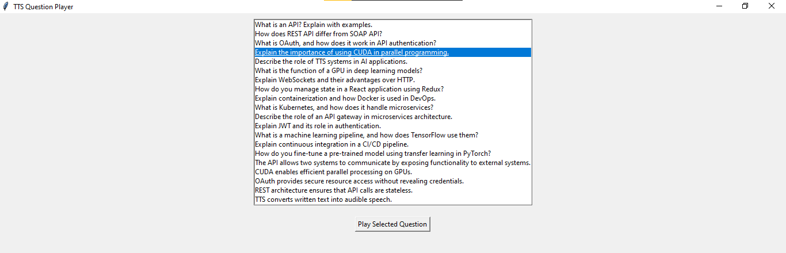

# Text-to-Speech (TTS) Interview Q&A System

This project implements a simple text-to-speech (TTS) interview question-and-answer system. It generates a dataset with technical interview questions and their corresponding audio using `gTTS` (Google Text-to-Speech) and provides a user-friendly interface to play the audio files. It also includes a graphical user interface (GUI) for easy navigation and interaction using `Tkinter`.

## Project Structure

- `data_generator.py`: Generates the dataset of interview questions and answers (TTS audio).
- `data_load.py`: Loads the dataset and metadata (CSV file).
- `Q&A_System.py`: Implements the core Q&A logic to play the audio for each interview question.
- `gui_app.py`: Provides a graphical user interface for selecting and playing the audio files.
- `ttt-dataset/`: Folder containing the generated dataset and audio files.

## Dependencies

Ensure you have the following dependencies installed:

- Python 3.x
- `gTTS` (Google Text-to-Speech)
- `pandas`
- `tkinter`

You can install the necessary Python packages using pip:

```bash
pip install gtts pandas
```

## Files Overview
1. data_generator.py
This script generates a dataset of technical interview questions and their corresponding audio files using gTTS. The generated data is stored in the ttt-dataset folder, and the metadata is saved in a CSV file.

To run this script, use:

```bash
python data_generator.py
```

2. data_load.py
This script loads the generated dataset from the ttt-dataset folder and reads the metadata (CSV file) to use it in the Q&A system or GUI application.

To use it:

```bash
python data_load.py
```


3. Q&A_System.py
This script implements the core question-and-answer system. It interacts with the user and plays the corresponding audio for each question when selected.

To run this script:

```bash
python Q&A_System.py
```

4. gui_app.py
This script implements a simple GUI application using Tkinter. Users can select a question from the list, and the corresponding audio will be played.

To launch the GUI:

```bash
python gui_app.py
```

## How It Works
1. Step 1: Dataset Generation
data_generator.py generates the technical interview dataset, saving the questions as audio files in ttt-dataset/audio/.
The questions are stored in a CSV file with metadata (question and corresponding audio path).
2. Step 2: Loading the Dataset
data_load.py reads the CSV metadata and loads the dataset. This can be used later for querying the Q&A system.
3. Step 3: Question & Answer System
Q&A_System.py provides a command-line interface to ask questions and plays the corresponding audio files.
4. Step 4: GUI Application
gui_app.py offers a graphical interface using Tkinter for users to interact with the system, select a question, and listen to the audio response.

## Dataset Example
The dataset contains technical interview questions such as:

- "What is an API? Explain with examples."
- "How does REST API differ from SOAP API?"
- "Explain the importance of using CUDA in parallel programming."
Each question is converted to an audio file using Google TTS and stored in ttt-dataset/audio/.

## Running the Project
1. Generate the dataset:
```bash
python data_generator.py
```

2. Load the dataset and play audio from the Q&A system:
```bash
python Q&A_System.py
```
3. Launch the GUI application:
```bash
python gui_app.py
```

## Screenshots



## Future Enhancements
- Add the option to add more questions dynamically through the GUI.
- Implement additional question types (e.g., multiple choice or open-ended).
- Extend the project to support other languages using different TTS engines.